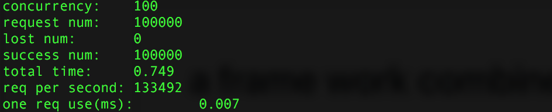
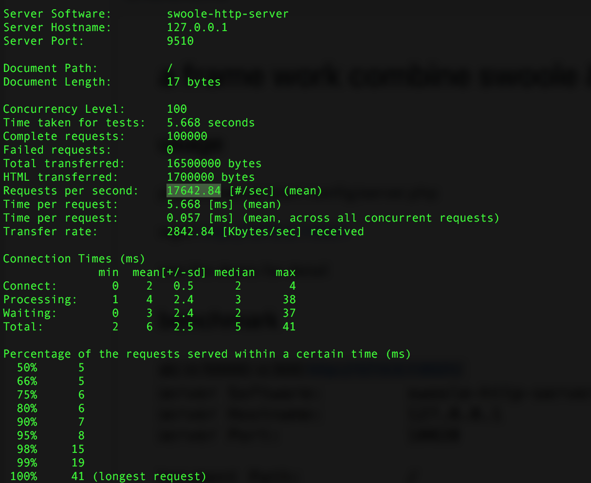

# a frame work combine swoole & phalcon

## install
```
composer require fsth/framework dev-master
```

## usage

### method
```
bin/server run|start|stop|restart config/server.php
```
```
run : run without daemon
start : run with daemon
```

### start server (http only)
```
cp config/server.php.example config/server.php
bin/server start config/server.php 
```

### start server (http & tcp)
```
cp config/multi-server.php.example config/multi-server.php
bin/server start config/multi-server.php
```

## benchmark

### environment
* ubuntu 14.04
* 8 core 
* 24 G
* 20 workers

### test

* php run.php -c 100 -n 100000 -s tcp://127.0.0.1:9511 -f long_tcp


* ab -n 100000 -c 100 http://127.0.0.1:9510/


## changelog 

### 2017-03-16 v0.1.5
```
add tcp service in multiServer
```

### 2017-05-15 v0.2.0
```
add bin/server cmd
```

### 2017-07-06 v0.3.0
```
add zipKin support
```